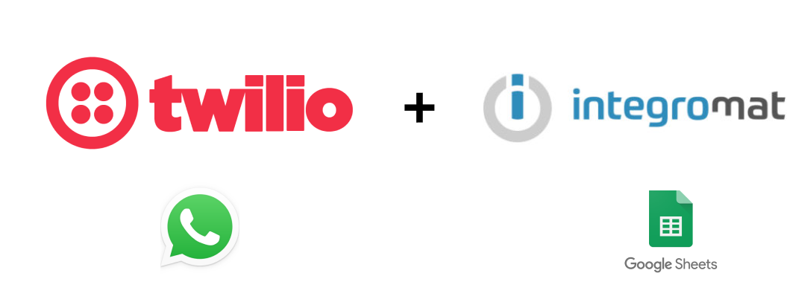
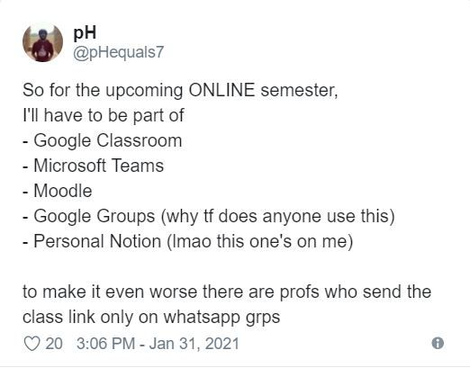
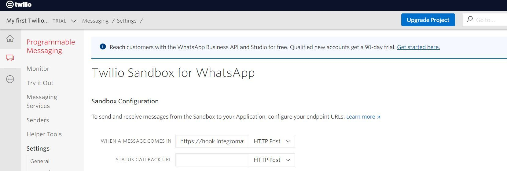
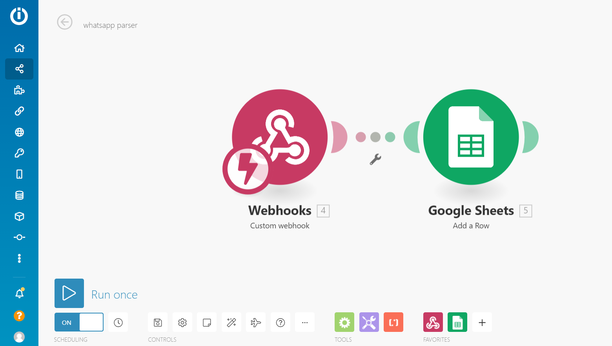
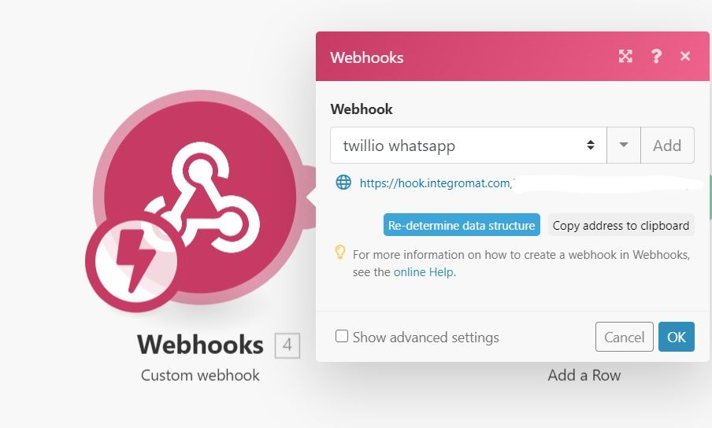
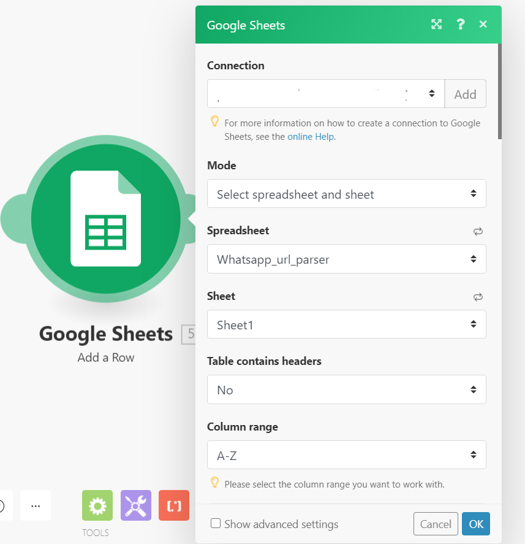

Ever since the dawn of the online-virtual-god awful depressing semester, our inboxes and WhatsApp chats were and are continue to be flooded with Zoom and Google Meet links. Now if you are not a self-respecting student who will join a class from their smartphones, this article is **NOT** for you!

Now if you are like me, due to the pandemic (and the lack of social life - that's for another article 😪) are always cooped up indoors and stuck near the laptop/desktop and knows that Web WhatsApp is very very slow when you want to join a sudden meeting but it refuses to open if your phone has not simultaneously opened the WhatsApp App at the exact moment on your smartphone and it is overall bad for your laptop's RAM (Hi Chrome!), you know where this is going..

So I wanted something to interface between my phone and my laptop without ever touching Web WhatsApp. And considering I receive these links from various course-based WhatsApp groups it would be an added bonus if I never had to leave WhatsApp.

So a WhatsApp bot seemed to be a natural fit for my requirement. And fortunately, **Twilio **provides a very easy-to-use WhatsApp API sandbox to play around along with webhooks (will explain more about that later).

## 💫What is Twilio?

Twilio is basically AWS but for anything communication-related i.e SMS, Voice, Video, Instant Messaging Services like Telegram and 🥁.... **WhatsApp!!**

They have a very simple sign up and registration process with a free tier plan as well (what more do we want!)

*Twillio's Dashboard for WhatsApp Sandbox*

Once you have created your "First Twilio Project", create an instance of a "Programmable Messaging" service

Now Twilio will neatly transfer my GMeet and Zoom links, but where should I store it so that I can quickly access it from my Laptop/Desktop? I went with **Google Sheets** because it has very easy and widespread No Code tool integrations plus everyone has a google account and Sheets open very quickly when compared to Web WhatsApp.

So how do I transfer the WhatsApp message sent to Twillio to the sheet of my choosing?

## ⚡Enter Integromat

Integromat is the lesser-known but far cheaper (virtually free for personal use-cases) competitor to **Zapier** (the most widely known workflow automation service)

Using Integromat, you can virtually connect 100+ services together to create complex workflow and automation services without writing a single line of code (**NO CODE!!**)

Here we'll be using this near-magical module called **[webhooks](https://sendgrid.com/blog/whats-webhook/)** to act as a conduit between our Twillio WhatsApp bot and Google Sheets (where we store our links/payload).

The URL present below your webhook name - '*hook.integromat.com/xxxx*' is the 'Hook' to your Twillio Bot and Integromat, which should be filled in the "When A Message is Incoming" field in the Twillio WhatsApp Sandbox

Connect with your Google Account of choice by providing permission to Integromat using OAuth and proceed.

Voila, you have made your first No-code based WhatsApp bot! Try sending messages to Twilio's Sandbox phone number and watch it magically appear on your Google Sheet instantaneously!

## 😏Caveats

- [TANSTAAFL](https://en.wikipedia.org/wiki/There_ain%27t_no_such_thing_as_a_free_lunch)! Twillio WhatsApp Sandbox has a time span of 72 hours post which you need to send the unique 'join' pass-key to reset the quota which can be mildly annoying at times but this is something which I learned to accept as a price you pay for "free" services!
- This bot is not "Duplex" or Two-Way i. e if I change or add anything on the sheet I do not get an update through this bot. This particular functionality is something I'm yet to fully explore which I'm sure some person on Reddit would have figured it out by now!
HMU on [LinkedIn](https://www.linkedin.com/in/pranav-hari/) or [Twitter](https://twitter.com/pHequals7) if you have made other interesting no-code based automations that can help you in your or my daily life! I'm still a newbie to this world and would love to know what more can be done with these tools!

