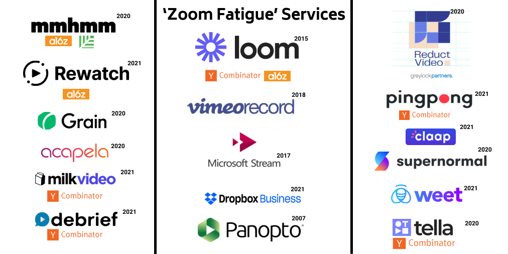

Startups and the companies operating in this space mainly offer recorded video management (that operate on top of popular video conferencing services like Zoom, Google Meet, and MS Teams) along with auto transcription which makes it very easy to search inside videos using text to get to the exact timestamp and the video where the particular term is transcribed. The new-age ones (most of them were started during the pandemic) are being positioned more as 'Zoom Fatigue' service due to it being asynchronous rather than an in-sync live Zoom meeting. Here is an almost exhaustive list of players operating in this area.

### Incumbent

Loom is informally a verb now!

- [Loom](https://www.loom.com/) - Category Definer. Started out as a chrome extension in 2015, currently valued at $1.53 Billion (Loom was also part of YC)
### Legacy Players (as a part of their existing suite of services)

- [Microsoft Stream](https://www.microsoft.com/en-ww/microsoft-365/microsoft-stream) - Part of Office 365's corporate video-sharing service
- [Vimeo Screen Recorder](https://vimeo.com/features/screen-recorder) - Record how-to videos, demos, and walkthroughs - offered as part of Vimeo's Video-as-a-Service package.
- [Panopto](https://www.panopto.com/) - Video Platform and Management as a service (similar to Vimeo - Full Stack Video Management)
- [Dropbox](https://www.dropbox.com/capture) has also started alpha testing their Loom clone as part of their Dropbox business suite of services - Dropbox Capture
### Challengers (Standalone Products)

- [Rewatch](https://rewatch.com/) - save, manage, and search all your video content generated from Video conferencing platforms - founders are GitHub alumni
- [Reduct Video](https://reduct.video/) - Transcribes your team’s recordings and allows everyone to search, edit, and share videos as easily as text.
- [Acapela](https://acape.la/) - collaboration platform for remote and hybrid teams through async videos - from the co-founders of the erstwhile viral app "Dubsmash" - Most comprehensive among the list
- [Supernormal](https://supernormal.com/) - async video sharing and messaging platform - the founding team is also remote (distributed across Americas and Europe) - Only for Mac as of now
- [Grain](https://grain.co/) - Record, transcribe, clip, and share video from Zoom in real-time
- [Weet](https://beeweet.com) - a video messaging tool that allows you to have asynchronous conversations with your team, partners, and customers - Founder is from France who also founded [Speach](https://speach.me/)
- [Claap](https://www.claap.io/) - wants to reduce the number of synchronous meetings with async meetings - European Startup
### From the house of Y Combinator

- [Milk Video](https://milk.video/) - Video Highlights from meeting recordings  - YC W21
- [PingPong](https://www.getpingpong.com/) - Collaborate using video, voice, and screen recordings with your team - built by a remote team - YC W21
- [Debrief](https://www.getdebrief.com/) - Async video messaging tool to replace Zoom calls and Slack Messages - YC W21
- [Tella](https://www.tella.tv/) - Instant sharing of recorded videos - split videos into shorter ones - runs on the browser - YC S20 (Pivoted from a collaborative video editor product)
### Outlier

- [mmhmm](https://www.mmhmm.app/) - making presentations stand out and more fun
  - Has now become a standalone app with version 2.0 (Chunky)
  - Separates Slides and Video Overlay with a custom player i.e one can choose to just see slides and audio narration or slides with video or just video
*What started out as general research into this area ultimately ended up being an article. Planning to do more "State of the X industry/product" type articles/info-pieces - One sector that has definitely caught my eye is the InsurTech space especially in Indi*a.

### *Thank you for reading this sasta Gartner-ish report!*

## References

Techcrunch

- [Could Claap, an asynchronous video meetings platform, end the tyranny of Zoom calls?](/c190e4f442204d61b71ac724c0a6a860#6eb1cadb97a84bc689684832ef8e744a)
- [Acapela, from the founder of Dubsmash, hopes ‘asynchronous meetings’ can end Zoom fatigue](https://techcrunch.com/2020/10/21/acapela/)
- [Reduct.Video raises $4M to simplify video editing](https://techcrunch.com/2021/02/11/reduct-video-funding/)
- [GitHub alumni are building Rewatch, a solution for your Zoom fatigue](https://techcrunch.com/2021/01/05/rewatch-seed/)

a16z blog-portfolio

- [Investing in Rewatch](https://a16z.com/2021/05/26/investing-in-rewatch/)
- [Investing in Loom](https://a16z.com/2021/05/20/investing-in-loom/)

- Y Combinator
- Sequioa portfolio
- Greylock portfolio
- Worklife portfolio
*All logos featured here are the I.P of the respective owners. No Copyright-Intellectual Property Infringement intended. *

