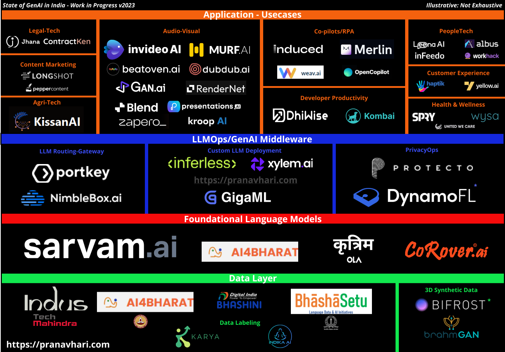

> *“The way this works is we're going to tell you, it's totally hopeless to compete with us on training foundation models you shouldn't try, and it's your job to like try anyway. And I believe both of those things. I think it is pretty hopeless.”*

This was Sam Altman’s response to PeakXV’s Rajan Anandan’s question in June 2023 during sama’s ‘world tour’ if India can compete with the likes of OpenAI and develop a rival to their wildly popular GPT and its family of products.

Fast forward six months to the end of 2023, we have seen a flurry of activity in the Indian GenAI space with a lot of green shoots in terms of new startups, Indic specific language models, [major fundraising](https://techcrunch.com/2023/12/06/indias-sarvam-ai-raises-41-million-from-lightspeed-khosla-peak-xv/) and [a M&A](https://www.livemint.com/companies/news/adobe-enters-into-indian-generative-ai-space-by-taking-over-rephrase-ai-all-you-need-to-know-about-the-deal-11700706574825.html) as well!

This is my take on a point-in-time state of the rapidly evolving yet nascent Indian GenAI ecosystem in what many (as myself) consider a paradigm shifting and epoch defining moment in technology and humanity as a whole - The Space Race of the 21st century! 

Please note that this is not a comprehensive market map of all Indian players, but rather an indicative and work-in-progress view of the present state that could be helpful for potential founders to focus their efforts on.

This market map is broadly divided into 4 parts - 

1. Data Layer - Indic languages dataset creation and curation
1. Foundational Models
1. LLMOps - GenAI Middleware and everything in between that helps manage your GenAI services.
1. Applications and use cases that leverage Generative AI
Please note that the criteria for appearing on this map is fairly simple - Indian here refers to 

## Where does the ‘generational’ opportunity lie?

- **Indic Foundational Models** - Our country has 22 officially recognized languages and another 500+ regional variations and unrecognized languages making us one of the world’s most diverse linguistic landscapes. Due to this, there is both a dearth in creating quality training datasets as well as building Large Language Models from the ground up native to the language’s script and nuances. One of the best examples for this can be found in Sarvam’s [OpenHathi LLM blogpost](https://www.sarvam.ai/blog/announcing-openhathi-series) where they mention the lack of unique Hindi words in ‘CommonCrawl’ a frequently used dataset for training LLMs and the need for language specific [tokenizers](https://huggingface.co/docs/transformers/tokenizer_summary). 
- **LLM Architectures - **Bulk of the Indic LLMs are based on the popular LLaMA 2 architecture - where potential founders can differentiate themselves here is by adapting bleeding edge model architectures like [Mamba](https://github.com/state-spaces/mamba) (Structured State Space) and Mistral’s [MoE models](https://mistral.ai/news/mixtral-of-experts/) (Mixture of Experts). While this is an area that is best reserved for academic/industrial AI researchers, I wouldn’t be surprised if an open-source implementation of the above models can beat the SoTA (state-of-the-art) for Indic language benchmarks.
- **GenAI native dev-tools** - Our market map clearly shows the lack of activity relative to the application stage when it comes to the developer landscape. Similarly, there are virtually no players from India providing vector database solutions (Pinecone, Weaviate, ChromaDB etc.) -  a core component for building LLM native applications or GPU platform services for compute and inference like a [Together](/b8cf8c965a8a411e8535296c383c97ed?pvs=25) or [Anyscale](https://www.anyscale.com/). It feels like what played out in the initial wave of developer focused tools and startups for Software 2.0 might repeat at this layer yet again with bulk of the innovation restricted to the Bay Area. But I sincerely hope I’m proven wrong!
- **That killer application** - It’s no surprise why ChatGPT was the most impactful product launch of 2022 and quite possibly of this decade - it was a category creator product that did not try to replace or mimic existing product experiences from the past. At this layer, most startups are susceptible to incumbents’ adoption of GenAI that might render the upstart defenseless against massive product distribution and mindshare. This is the layer that is probably the most paradoxical - Building a GenAI app now is relatively easy due to the proliferation of low-cost inferences, but deciding what to build remains the most elusive challenge!
> 💡 **Disclaimer - **Except for proof-reading** **no other GenAI services were used in the making of this market map and article 😉

As always, comments and criticisms both are welcome! I plan on updating this map as and when I come across an interesting product/service in GenAI from India.

Here's to a more cluttered and denser map in 2024 - Happy New Year!

