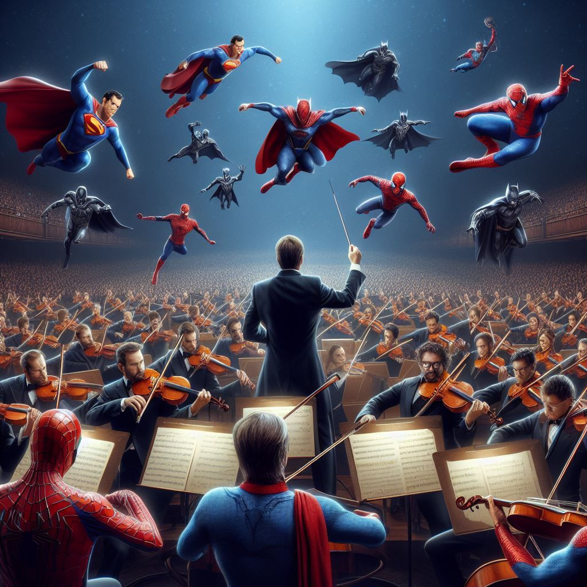

> 👀 Disclaimer - the usage of 'leitmotifs' in this post may be quite liberal. Only movies released post-2010 and pre pandemic have been included.

If there was one thing I did diligently during the lockdown was subscribe to Spotify Premium and carefully curate my Epic Scores Playlist

The basic criterion for any OST to appear in my list is simple

- Thematic Continuity - establish a base or main theme for the central character(s) and derive variations based on that at key moments in the film and the universe (looking at you 😏 MCU) - ***[LEITMOTIF](https://en.wikipedia.org/wiki/Leitmotif)***
- Recall Value - If someone plays or hears the theme, the scene or the movie should come to your mind
- Hum-ability (most if not all of John Williams themes satisfy this condition)
## Joker (2019) - Hildur Guðnadóttir (Ctrl C + Ctrl V FTW)

[Embedded content](https://open.spotify.com/embed/track/2S2ASICVK0L1LtjaysKsel)

This score won the Academy, Golden Globe, and the BAFTA in a single year so enough said? But Hildur whose last name I will not attempt to spell ([and fail like Sigourney Weaver while reading her name during the 2020 Oscars](https://youtu.be/JKeUKan00ec?t=4)), haunting use of the cello right from the start when the ‘JOKER’ title card is on the screen till the end when Arthur Fleck jumps on top of the car and the scene where Arthur embraces his Joker persona is simply out of this world.

## Man of Steel (2013) - Hans Zimmer

[Embedded content](https://open.spotify.com/embed/track/229lqwvjAJuDgRCkSXwOJm)

Imagine recreating a theme for a character who basically ushered in both the comic book and comic book movie revolution and also has one of the most iconic-recognizable themes in cinematic history! That was the mountain of a challenge Hans had to overcome and boy did he come out ‘flying’. Unlike John Williams's beautiful theme which in classical music terms is a ‘March’, Zimmer created more of a modern epic soundscape partly composed digitally along with an orchestra but a central theme composed of just a handful of piano notes amidst the bombastic music much like the character in the film who considered himself more human than alien.

It was just unfortunate that this theme was not widely used in the 2017 Justice League movie since that was scored by Danny Elfman

## Spider-Man Far From Home (2019) - Michael Giacchino

[Embedded content](https://open.spotify.com/embed/track/2Y9v6F9vFK9Z8KAoFwAj9Z)

This OST portrays a perfect mix of Peter’s playfulness as a teenager but at the same time his responsibilities as a superhero. Giacchino has even inserted ‘inspired themes’ from Danny Elfman’s equally impressive OST from the Sam Raimi trilogy. In the hum-ability area, this definitely ‘scores’ points. Leitmotif riddled score!

## Black Panther (2018) - Ludwig Göransson

[Embedded content](https://open.spotify.com/embed/track/2mjbf9ZvCoYqTi0RZ2FTUJ)

Another Academy Award-winning score on this list. In my opinion the most complete soundtrack in the MCU. The protagonist has an awesome theme, the “villain” also has a dope af theme, and Wakanda - the location has a jaw-dropping trumpet opening section theme. Considering the composer spent close to 6 months in Africa studying the continent’s different styles of music, using authentic instruments and musicians from that region, it overall added a layer of complexity generally not found in comic book movie music scores especially among Marvel movies. Watch this [Genius clip](https://www.youtube.com/watch?v=fcO5klPyfX4) on the Behind the Scenes while Ludwig was scoring the Black Panther OST. He is the next composer to watch out for!

## Guardians of the Galaxy (2014) - Tyler Bates

*“GoTG are the Avengers but in Space” - Random YouTube commenter. *Cannot be described better than this, Tyler Bates crafted one of MCU’s best scores like a space opera. We all know GoTG has a great soundtrack but an equally compelling background score was not expected. Of all the Marvel standalone movies, this one has the best leitmotif adherence. Tyler Bates beautifully builds the ultimate team-up theme for their escape from the Kyln Prison and once again during the final battle against Ronan.

[Embedded content](https://www.youtube.com/embed/GBp1Y-LoObs?feature=oembed)

