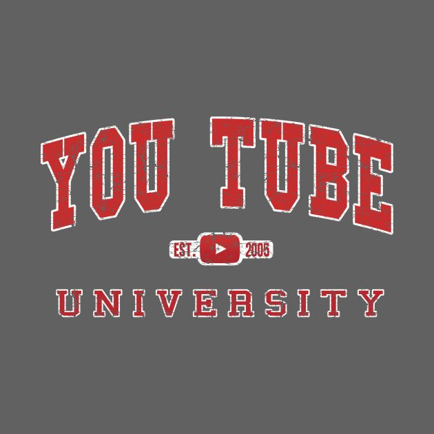
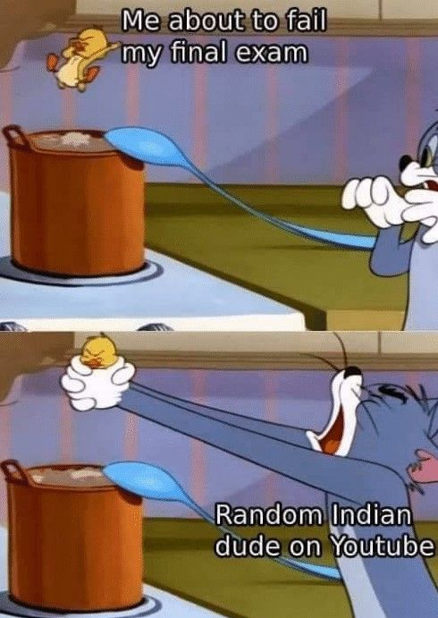

If you have seen the above meme or a variant of this on any social network, there’s a reason for that! Also, this meme along with how much “ed-tech” has become popular in India especially due to the pandemic, was one of the main inspirations for my debut in writing.

**Education** as a category on YouTube is different from what we understand as educational. On YouTube, the three most subscribed 'educational' channels are actually channels that produce nursery rhyme videos aimed at toddlers and kindergarten children (Incidentally the second biggest educational channel - [ChuChu TV](https://www.youtube.com/user/TheChuChuTV) with 57.9M subs is based out of my home city - Chennai).

Broadly edu-content on YouTube can be anything from a [Crash Course on Sociology](https://www.youtube.com/watch?v=YnCJU6PaCio) to Verge Science’s cinematically made videos on [Nuclear Waste](https://www.youtube.com/watch?v=YgVyPwhkoJs). Although all of them could be broadly classified as “educational” content, when it comes to conventional ed-tech, a curriculum-based approach is the widely accepted way to offer courses with top-quality educators just like any MOOC platform.

## 📚Current State of YouTube Education

The current avatar of YouTube [Education](https://www.youtube.com/education) is a hotchpotch of randomly created topics and its related videos (Incidentally this feature/channel of YouTube started only on March 17th very close to the start of the pandemic-induced lockdown). This in a way shows how education as a category is under-utilized. The user experience when compared to their more established sub-verticals like YouTube Gaming and Music (which has a premium offering as well) is also nonexistent.

## ⛏️The Content Goldmine

YouTube is the host to several high-quality undergraduate and graduate-level lectures from the topmost universities in the world that includes MIT (through the OpenCourseWare initiative), Stanford University and closer home would be the Ministry of HRD (now renamed as Ministry of Education) funded NPTEL which has lectures from the top IITs and India’s foremost research institution -  IISc.  Other non-University based video series would include Khan Academy, 3blue1brown, Green bros’ Crash Course series.

Referring back to the meme at the top, the actual game-changer in terms of edu-content on YouTube would be the numerous Indian “tutoring”/”coaching” classes which offer chapter and even concept-wise videos as prescribed by the Indian competitive exam curriculum. They can be your next-door neighbor with a whiteboard and a tripod camera setup or it can be the institutes from Kota - [India’s coaching capital](https://www.business-standard.com/article/current-affairs/india-s-garish-free-market-in-education-115123100033_1.html) or it can be the new age ed-tech startups like Unacademy, Vedantu, or Byju’s whose content have slick animations and focuses on “experiential learning”. The cherry on top of the cake is that all of these are available for free. (Many of these are also in India’s regional languages hence boosting accessibility)

## 😷Post COVID🤞🏽

During the lockdown, many college professors and school teachers leveraged YouTube’s robust platform to conduct live classes as well as upload content since it is practically free to store lecture videos there instead of a Drive folder which is not as optimized for videos as YouTube is.

With the current setup, content uploaders make subject and course-specific video playlists for easy visibility with elaborate descriptions to be ranked higher in search queries.

## 🔬What's Required?

Any ‘Full Stack’ EdTech venture needs to have 3 primary components ready

1. Content (is the King)
1. Doubt Clarification/Discussion Forum
1. Assessment - Certifications
Now YouTube already ticks 2 out of those 3 boxes with some of the best content available in the world from the above-mentioned universities and educators and a quick modification of the “much-loved/hated” comment section in YouTube can make it as huge as Stack Exchange or probably bigger than that as a doubt clarification forum (Allow it to be SEOed). The addition of a search function to this modified comment box would make it easier to search if your doubt has already been asked.

Now coming to the harder part - Assessment. Here YouTube might have to build something from the ground up if it wants to offer the complete MOOC experience with certifications where assessments are an integral part of the full-stack offering.

Now the content creators would just need to curate their playlists according to the curriculum they are targeting using a platform similar to YouTube Studio which would act as their CMS for educational content.

Interestingly in [The Ken's interview](https://the-ken.com/story/the-interview-gaurav-munjals-plans-to-become-the-netflix-of-education/) with Unacademy (which is currently one of India's top ed-tech startups - $2 Billion in valuation) founder Gaurav Munjal , he says

>  "Our idea was that if more people like us (educators) were empowered, we could take a stab at creating a “YouTube for education”. We had seen what Twitch did for gaming on YouTube and it was valued at a billion dollars."

In the same interview, he also says this,

> Unacademy as the “Netflix for education”—as all the classes are accessible as long as you are a subscriber.

## 💸Biz Model - the OG "Netflix for Education"

We need not look any further than YouTube's own Premium subscription model which provides an Ad-Free YouTube experience for a monthly fee. If YouTube was to bring its Education/University offering under this, educational content creators would get more spotlight under a focussed brand offering along with the [Subscription Revenue Sharing](https://support.google.com/youtube/answer/6306276?hl=en) which is not based on ad-revenue.

So ultimately, the major differentiation between the paid YouTube Education offering and a vanilla, free YouTube experience would be the content curation in terms of customized playlists (similar to YouTube Music) for particular exams, subjects or chapters and assessment features which culminates in a certificate from the respective course partner.

## 📊Stats

*Figures as of Jan 11th 2021

<!-- Database/Collection -->

*Wifistudy is now owned by Unacademy!

Some more Stats - 

- YouTube's DAU in India as of December 2020 is [450 Million](https://techcrunch.com/2021/01/11/youtube-and-whatsapp-inch-closer-to-half-a-billion-users-in-india/) which is massive!
- If Google was the biggest search engine globally in terms of volume of searches, the next biggest Search Engine is [YouTube](https://www.mushroomnetworks.com/infographics/youtube---the-2nd-largest-search-engine-infographic/)!
## 🔮Future Scope

Considering this entire article is hypothetical i.e if YouTube starts an ed-tech vertical, an interesting use-case I can see happening is bundling of the eventual YouTube University/Education app in a lot of learning devices (tablets) powered by Android with GSuite for education plans. This is an ecosystem Google is well poised to flex its muscles in considering Google Classroom is one of the most widely used Learning Management Softwares being used across schools and colleges. 

Considering in many urban households in India, YouTube has already replaced TV as the primary source of entertainment (barring seasonal events like the IPL), with education thrown into the mix, YouTube can truly become the video Super-App.

